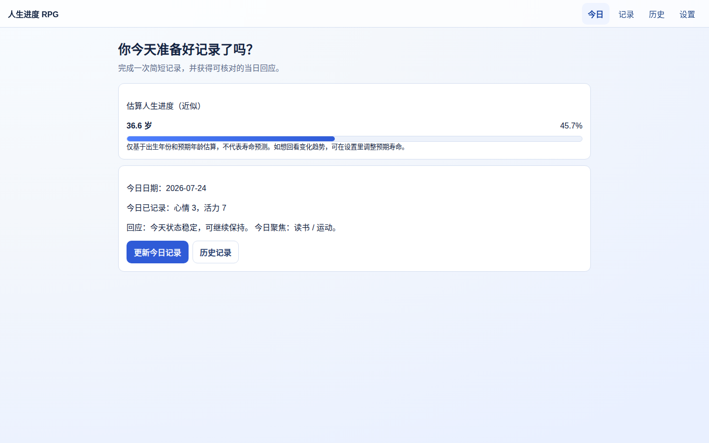
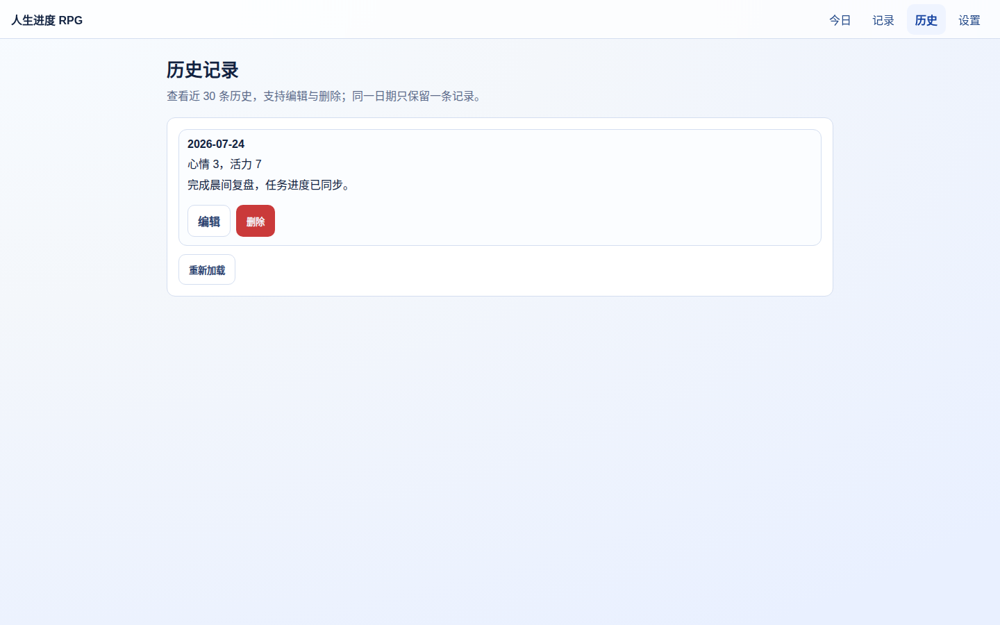
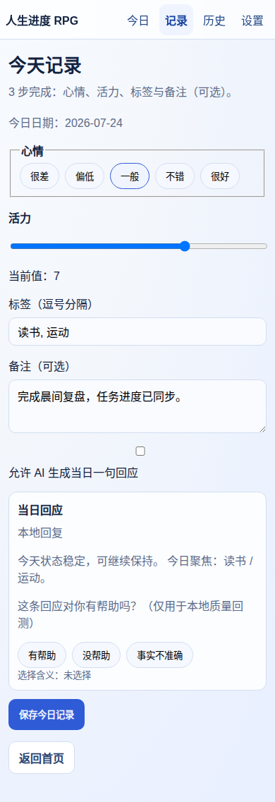
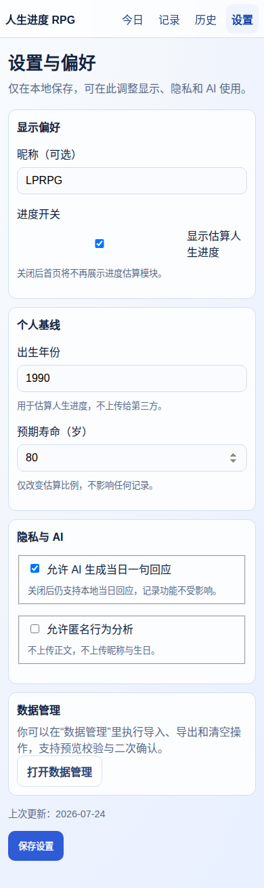
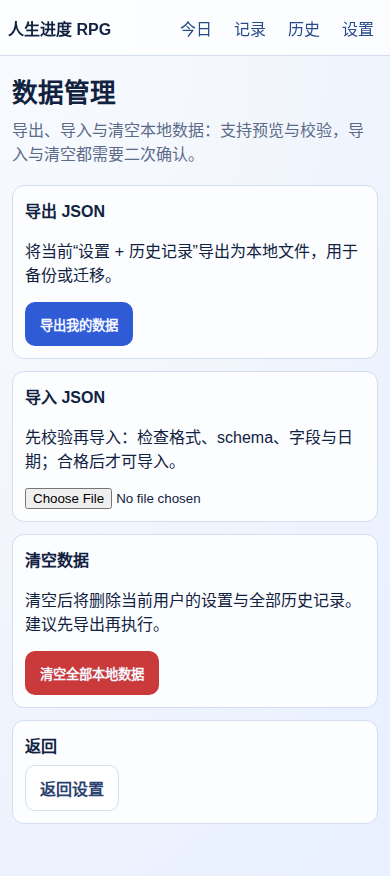

<div align="center">

# 人生进度条 RPG

**把每天的状态留在自己手中，用低负担记录积累可回看的生活线索。**

[](https://react.dev/)
[](https://www.typescriptlang.org/)
[](https://vite.dev/)
[](#隐私与数据)
[](./life-progress-rpg/LICENSE)

[快速开始](#快速开始) · [功能概览](#功能概览) · [项目文档](#项目文档) · [开发计划](#开发计划)

</div>

---

## 项目简介

人生进度条 RPG 是一个本地优先的个人记录 Web 应用。它用明确标注为“估算”的人生进度带来第一次关注，再通过心情、能量、标签和备注，让一次日常记录尽量在 60 秒内完成。

数据默认保存在当前浏览器的 IndexedDB 中；没有账号、没有排行榜，也不会因为未启用 AI 而影响记录功能。

> 当前状态：`v0.1` 验收阶段。核心流程已经可以运行，人工体验验收和发布指标仍在完善中。

## 界面预览

<table>
  <tr>
    <td width="50%" align="center"><strong>今日首页</strong></td>
    <td width="50%" align="center"><strong>历史记录</strong></td>
  </tr>
  <tr>
    <td></td>
    <td></td>
  </tr>
</table>

<details>
<summary><strong>查看更多页面</strong></summary>

<br />

<table>
  <tr>
    <td width="33%" align="center"><strong>每日记录</strong></td>
    <td width="33%" align="center"><strong>设置与偏好</strong></td>
    <td width="33%" align="center"><strong>数据管理</strong></td>
  </tr>
  <tr>
    <td></td>
    <td></td>
    <td></td>
  </tr>
</table>

</details>

## 功能概览

| 能力 | 当前实现 |
| --- | --- |
| 人生进度 | 根据出生年份和预期年限进行近似计算，始终标注“估算”，可随时关闭 |
| 每日记录 | 记录心情 1～5、能量 0～10、标签和可选备注 |
| 当日回应 | 默认使用本地规则即时生成；AI 不可用时不影响保存 |
| 历史管理 | 查看、编辑和删除最近记录；同一用户同一天只保留一条 |
| 数据控制 | JSON 导出、校验后导入、二次确认清空 |
| 隐私偏好 | AI 与匿名分析分别明示同意，默认关闭 |
| 响应式界面 | 覆盖手机、平板和桌面常见视口 |

### v0.1 不包含

账号和云同步、社交分享、排行榜、正式 XP/成就、周期报告、深度 AI 对话，以及医疗、心理、法律或财务建议均不在当前版本范围内。

## 技术架构

```text
React + TypeScript
        │
        ├── Features     页面与用户流程
        ├── Domain       日期、进度、记录与回应规则
        ├── Data         Repository + Dexie / IndexedDB
        ├── Services     可选的同源 AI 请求边界
        └── Shared       通用 UI、类型与工具
```

主要技术：

- React 18、TypeScript、React Router
- Vite、Tailwind CSS
- Dexie / IndexedDB
- Vitest、ESLint
- 可选 AI 同源代理接口：`POST /api/reflections`

## 快速开始

### 环境要求

- Node.js 20 或更高版本
- npm

### 本地运行

```bash
git clone https://github.com/fulijingjiu/life-progress-rpg.git
cd life-progress-rpg/life-progress-rpg
npm install
npm run dev
```

开发服务器默认运行在 `http://localhost:3000`；如端口被占用，Vite 会选择其他可用端口。

### 质量检查

```bash
npm run lint
npm run test -- --run
npm run build
python .codex/skills/implement-life-progress-rpg/scripts/validate_project.py
git diff --check
```

## 隐私与数据

- 用户设置和生活记录默认仅保存在当前浏览器的 IndexedDB。
- AI 同意和匿名分析同意相互独立，默认均为关闭。
- 未同意 AI 时，不发送记录内容。
- AI 请求失败时保留本地记录和本地回应。
- 浏览器端不保存 AI 供应商密钥；真实 AI 调用必须经过同源服务端代理。
- 用户可以随时导出 JSON 备份或清空本地数据。

## 项目文档

| 文档 | 内容 |
| --- | --- |
| [文档中心](./life-progress-rpg/docs/README.md) | 全部设计、规划、研究和技术资料入口 |
| [MVP 规划](./life-progress-rpg/docs/项目规划/milestone-v1.md) | v0.1 范围、验收标准与风险 |
| [实施状态](./life-progress-rpg/docs/项目规划/implementation-status.md) | 当前完成项、阻塞项和下一步 |
| [系统架构](./life-progress-rpg/docs/技术设计/architecture.md) | 模块边界、数据流和演进条件 |
| [数据设计](./life-progress-rpg/docs/技术设计/database.md) | IndexedDB 模型、索引与迁移原则 |
| [AI 安全设计](./life-progress-rpg/docs/技术设计/ai-design.md) | 同意、代理、输出约束与失败回退 |
| [UX 规范](./life-progress-rpg/docs/产品设计/ux-spec-v2.md) | 页面流程与交互规范 |
| [质量基线](./life-progress-rpg/docs/产品设计/quality-bar.md) | 视觉、内容、无障碍和响应式要求 |

## 开发计划

当前优先完成：

- 阶段 H 自动化视觉、交互与内容验收
- 离线、错误和 AI 回退状态复核
- 用户验证指标的采样口径与结果记录
- 发布前文档与质量证据闭环

完整进度请查看[实施状态](./life-progress-rpg/docs/项目规划/implementation-status.md)和[路线图](./life-progress-rpg/docs/项目规划/roadmap.md)。

## 参与开发

提交代码前请先阅读[项目规则](./life-progress-rpg/AGENTS.md)。项目坚持本地优先、数据最小化和可退出设计；功能修改应同时覆盖测试、异常状态、隐私边界与相关文档。

## License

本项目采用 [MIT License](./life-progress-rpg/LICENSE)。

<div align="center">

如果这个方向对你有启发，欢迎留下 Star 或参与完善。

</div>
